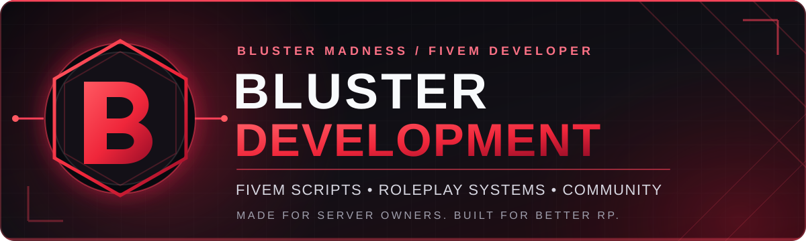

<div align="center">



<br />

**FiveM developer • BlackLight RP creator • Probably fixing one more Lua script**

<br />

<a href="https://github.com/BlusterMadness?tab=repositories"></a>
<a href="https://discord.gg/GJTPqFnTxE"></a>
<a href="https://bluster-development.tebex.store"></a>

</div>

---

### 👋 Hey, I'm Bluster!

I'm the creator behind **Bluster Development** and **BlackLight RP**. I make FiveM resources that help server owners build better experiences, from small quality-of-life fixes to configurable roleplay systems.

Most of my work starts with the same question: **“Would this make running or playing on a server more fun?”** If the answer is yes, I'm probably already working on it.

- 🔴 **Building:** FiveM scripts, custom systems, and polished interfaces.
- 🛠️ **Working with:** Lua, QBCore, JavaScript, HTML/CSS, ox_lib, ox_target, and MariaDB.
- 🎮 **Running:** BlackLight RP — where ideas turn into actual gameplay.
- 🤝 **Sharing:** Free community resources alongside projects from Bluster Development.

### 🚀 Featured projects

| Project | What it does |
| :--- | :--- |
| 🏪 **[bluster-pawn](https://github.com/BlusterMadness/bluster-pawn)** | A configurable QBCore pawn shop for selling inventory items. |
| 🎯 **[bluster-crosshair](https://github.com/BlusterMadness/bluster-crosshair)** | A lightweight, standalone FiveM aiming crosshair. |
| ❤️ **[bluster-stopregen](https://github.com/BlusterMadness/bluster-stopregen)** | Prevents unwanted default health regeneration without affecting buffs. |
| 🚶 **[bluster-stopcombatwalk](https://github.com/BlusterMadness/bluster-stopcombatwalk)** | Stops the lingering combat walk after shooting. |

<div align="center">
<a href="https://github.com/BlusterMadness?tab=repositories"><strong>See all my public repositories →</strong></a>
</div>

### ⚡ What I'm into

```text
FIVEM DEVELOPMENT    ████████████████████  LUA & QBCORE
SERVER OWNERSHIP     ████████████████████  BLACKLIGHT RP
QUALITY-OF-LIFE      ████████████████████  SMALL FIXES, BIG DIFFERENCE
UI / UX              ████████████████████  PERSONALITY INCLUDED
```

### 💬 Let's connect

Working on a FiveM server, using one of my resources, or just want to hang out? Find me in the **[Bluster Development Discord](https://discord.gg/GJTPqFnTxE)**, check out the **[GitHub projects](https://github.com/BlusterMadness?tab=repositories)**, or browse my FiveM scripts at the **[Bluster Development Tebex Store](https://bluster-development.tebex.store)**.

<div align="center">

---

**Made for server owners. Built for better RP.** ❤️

<sub>© Bluster Development · Bluster_Madness</sub>

</div>
